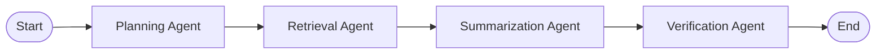

# IKMS Backend - Intelligent Knowledge Management System

FastAPI backend with a **4-agent RAG pipeline** featuring query planning and decomposition for enhanced information retrieval.
Uploaded and Indexed PDF file is [here](data/uploads/pinecone_vector_database.pdf)

## 🚀 Feature: Query Planning & Decomposition Agent

This system implements an intelligent query planning layer that significantly improves retrieval quality for complex, multi-faceted questions.

### The Problem It Solves

Traditional RAG systems perform a single retrieval call with the user's raw question. This approach fails when:

- Questions contain multiple distinct topics or aspects
- Comparisons between different concepts are requested
- Complex technical queries require information from different document sections

**Example:** _"Explain the different indexing algorithms used in vector databases and compare their trade-offs."_

A single retrieval might miss information about specific algorithms, leading to incomplete or failed answers.

### The Solution

Our **4-agent pipeline** introduces an intelligent planning phase before retrieval:



#### Pipeline Flow

1. **Planning Agent** 🧠

   - Analyzes the question for complexity and multiple aspects
   - Creates a natural language search strategy
   - Decomposes complex questions into 2-4 focused sub-questions
   - Uses RISEN format prompts for consistent, high-quality planning

2. **Retrieval Agent** 🔍

   - Executes multiple Pinecone searches (one per sub-question)
   - Aggregates results from all queries
   - Deduplicates retrieved chunks to avoid redundancy
   - Returns comprehensive context covering all question aspects

3. **Summarization Agent** 📝

   - Generates a draft answer based on the aggregated context
   - Provides structured, clear responses
   - Serves as the "thinking" phase visible to users

4. **Verification Agent** ✅
   - Reviews the draft for accuracy and hallucinations
   - Removes any claims not supported by the context
   - Produces the final, verified answer
   - Streams tokens in real-time to the frontend

### Example Planning Output

**Question:** _"What are the advantages of vector databases compared to traditional databases, and how do they handle scalability?"_

**Generated Plan:**

```json
{
  "plan": "This question has three distinct aspects: (1) advantages of vector databases, (2) comparison with traditional databases, and (3) scalability mechanisms. Each aspect requires separate retrieval for comprehensive coverage.",
  "sub_questions": [
    "vector database advantages benefits features",
    "vector database vs traditional relational database comparison differences",
    "vector database scalability horizontal scaling sharding replication"
  ]
}
```

The retrieval agent then executes 3 separate searches, ensuring all aspects are thoroughly covered.

### Results

See [before-after-results.md](../before-after-results.md) for detailed comparison showing:

- ✅ 5/5 questions answered comprehensively (vs. 3/5 before)
- ✅ Complex multi-part questions now receive complete coverage
- ✅ Previously failed queries now return detailed, structured answers

## 📡 API Endpoints

### `POST /qa/stream` - Streaming Question-Answering

Real-time SSE streaming endpoint with metadata.

**Request:**

```json
{
  "question": "What is HNSW indexing?"
}
```

**Response Stream:**

```
data: [PLAN]{"plan":"...","sub_questions":[...]}
data: [REASONING]Draft answer text...
data: [CONTEXT]Retrieved document chunks...
data: A
data:  vector
data:  database
...
data: [DONE]
```

**Special Markers:**

- `[PLAN]` - Query plan and sub-questions (JSON)
- `[REASONING]` - Draft answer from Summarization Agent
- `[CONTEXT]` - Retrieved RAG context from Pinecone
- `[DONE]` - Stream completion

### `POST /qa` - Non-streaming Question-Answering

Returns complete response as JSON.

**Response:**

```json
{
  "answer": "Final verified answer...",
  "context": "Retrieved document chunks...",
  "plan": "Search strategy explanation...",
  "sub_questions": ["sub-query 1", "sub-query 2", ...]
}
```

### `POST /ingest` - Upload PDF Documents

Upload PDF files for indexing into Pinecone.

**Request:**

```bash
curl -X POST http://localhost:8001/ingest \
  -F "file=@document.pdf"
```

## 🛠 Tech Stack

- **FastAPI** - Modern web framework with async support
- **LangChain** - LLM orchestration and agent creation
- **LangGraph** - Multi-agent workflow management
- **Pinecone** - Vector database for semantic search
- **OpenAI** - LLM (GPT-4o-mini) and embeddings (text-embedding-3-small)
- **PyPDF** - PDF document processing
- **Pydantic** - Settings management and validation

## 🏃 Local Setup

### Prerequisites

- **Python 3.10+**
- **uv** package manager ([installation guide](https://github.com/astral-sh/uv))
- **OpenAI API key** ([get one here](https://platform.openai.com/api-keys))
- **Pinecone account** ([sign up](https://www.pinecone.io/))

### Installation

1. **Clone the repository**

   ```bash
   git clone <repository-url>
   cd ikms-be
   ```

2. **Create `.env` file**

   Copy the example file and fill in your credentials:

   ```bash
   cp .env.example .env
   ```

   Edit `.env` with your API keys:

   ```env
   OPENAI_API_KEY=sk-proj-...
   PINECONE_API_KEY=pcsk-...
   PINECONE_INDEX_NAME=your-index-name
   ```

3. **Install dependencies**

   ```bash
   uv sync
   ```

4. **Create Pinecone index**

   Create an index in the Pinecone console with:

   - **Dimensions:** 1536 (for text-embedding-3-small)
   - **Metric:** Cosine similarity
   - **Cloud/Region:** Your preferred location

5. **Upload documents (optional)**

   Place PDF files in `data/uploads/` or use the `/ingest` endpoint:

   ```bash
   curl -X POST http://localhost:8001/ingest \
     -F "file=@your-document.pdf"
   ```

### Running the Server

**Development mode (with auto-reload):**

```bash
uv run uvicorn src.app.api:app --host 0.0.0.0 --port 8001 --reload
```

**Production mode:**

```bash
uv run uvicorn src.app.api:app --host 0.0.0.0 --port 8001
```

The API will be available at `http://localhost:8001`

**API Documentation:** Visit `http://localhost:8001/docs` for interactive Swagger UI

## 📁 Project Structure

```
ikms-be/
├── src/app/
│   ├── api.py                      # FastAPI routes and endpoints
│   ├── models.py                   # Pydantic request/response models
│   ├── core/
│   │   ├── config.py              # Environment configuration
│   │   ├── agents/
│   │   │   ├── prompts.py         # RISEN format system prompts
│   │   │   ├── agents.py          # Agent creation and node functions
│   │   │   ├── state.py           # QAState TypedDict schema
│   │   │   ├── graph.py           # LangGraph workflow definition
│   │   │   └── tools.py           # Retrieval tool for Pinecone
│   │   ├── llm/
│   │   │   └── factory.py         # OpenAI model initialization
│   │   └── retrieval/
│   │       ├── vector_store.py    # Pinecone setup and retrieval
│   │       └── serialization.py   # Document chunk formatting
│   └── services/
│       ├── qa_service.py          # Question-answering orchestration
│       └── indexing_service.py    # PDF ingestion pipeline
├── data/uploads/                   # PDF storage directory
├── .env                           # Environment variables (create from .env.example)
├── .env.example                   # Template for environment setup
├── pyproject.toml                 # Project dependencies
└── README.md                      # This file
```

## 🔧 Configuration Options

All settings are defined in `.env`:

| Variable                       | Required | Default                  | Description                    |
| ------------------------------ | -------- | ------------------------ | ------------------------------ |
| `OPENAI_API_KEY`               | ✅ Yes   | -                        | OpenAI API key                 |
| `PINECONE_API_KEY`             | ✅ Yes   | -                        | Pinecone API key               |
| `PINECONE_INDEX_NAME`          | ✅ Yes   | -                        | Pinecone index name            |
| `OPENAI_MODEL_NAME`            | No       | `gpt-4o-mini`            | LLM model for agents           |
| `OPENAI_EMBEDDINGS_MODEL_NAME` | No       | `text-embedding-3-small` | Embeddings model               |
| `RETRIEVAL_K`                  | No       | `4`                      | Number of chunks per retrieval |

## 🎯 Key Implementation Details

### RISEN Format Prompts

All agent prompts use the RISEN format for consistency and quality:

- **R**ole - Agent's purpose and responsibilities
- **I**nstructions - Step-by-step task breakdown
- **S**tructure - Expected output format
- **E**xamples - Concrete examples for guidance
- **N**eglect Clause - Edge cases and failure modes

### State Management

The `QAState` TypedDict tracks data across the pipeline:

```python
class QAState(TypedDict):
    question: str                    # Original user question
    plan: str | None                 # Search strategy
    sub_questions: list[str] | None  # Decomposed queries
    context: str | None              # Retrieved chunks
    draft_answer: str | None         # Summarization output
    answer: str | None               # Final verified answer
```

### Streaming Implementation

The `/qa/stream` endpoint uses FastAPI's `StreamingResponse` with async generators to stream tokens in real-time while preserving the complete pipeline execution.
